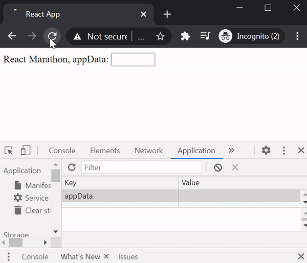

# React online marathon

## The task of the topic "Hooks"

There is the functional component `App` which renders one element `div` with text `React Marathon` in it

Using `hooks` write code to provide next functionality: on page load, the component `App` fetches from `localStorage` a value of key `appData` and puts it in the `input`

### Example
<kbd>
  
</kbd>